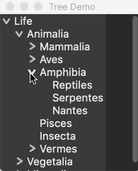
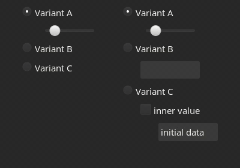
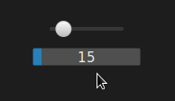

# `druid-widget-nursery`

[](https://github.com/linebender/druid-widget-nursery/actions/workflows/rust.yml)

This repo contains (or, at the time of writing, will contain) widgets that work with `druid`. The repo follows a policy of [optimistic merging], and the idea is that having a lower barrier to merging PRs hopefully leads to a nice contributor experience, which then encourages more people to become regular collaborators for the whole `druid` family of crates.

We don't insist that all widgets always build when updating to a newer version of `druid`, and so as you'll see the CI is allowed to fail. Fixing these build failures will often be a good opportunity for a first contribution, and people will always be willing to help out with this work either here or [on zulip][xi zulip].

So, in summary, the default assumption for PRs to this repo will be to merge, but this policy includes future PRs that might change or reverse stuff in previous PRs. For more information I recommend reading [the optimistic merging article linked here and above][optimistic merging], which offers an interesting approach to managing open source projects irrespective of its use here.

## Using this library

Add the following to your `Cargo.toml`. You will need to get the current druid `rev` from this repository's [Cargo.toml](Cargo.toml).
```toml
druid-widget-nursery = { git = "https://github.com/linebender/druid-widget-nursery" }

[patch.'https://github.com/linebender/druid'.druid]
git = "https://github.com/linebender/druid"
rev = "<copy the current druid rev from this repository's Cargo.toml>"
```
The `rev` in your `Cargo.toml` should match the `rev` under `[dependencies.druid]` in this repo's `Cargo.toml`. This ensures that your app depends on the same version of druid as this library - otherwise you may end up with problems with [multiple versions of `druid` installed](https://github.com/linebender/druid-widget-nursery/issues/20). For more on the override syntax above, see [Cargo's `patch` documentation](https://doc.rust-lang.org/cargo/reference/overriding-dependencies.html).

Once you have `druid-widget-nursery` installed, you can import the various widgets as usual with `use druid_widget_nursery::YourWidgetNameHere`. For specific examples of using the various widgets, check out the [examples](examples/) directory.

# Widgets

If you add a new widget, please add its name and a short summary here.

 - A tree widget

   
 - A Navigator widget that can display different child widgets/views.
 - Dropdown : a basic dropdown widget using the recently added sub-windows
 - Dropdown Select : a basic widget for selecting one item out of a dropdown list

   
 - List Select : a basic widget to select one item out of a list
 - Animator : a helper for running multiple animations with different curves/timing/dependencies
 - Animated : a helper for simple transitions.
 - PartialWidget : a widget that shows a widget if its data is present
   
   
 - MultiRadio : a Radio that represents multiple values through an inner widget
 - MultiCheckbox : a Checkbox that represents multiple values through an inner widget
 - Switcher : a widget which displays the first widget for which the associated Prism returns `Some()`
 - LazySwitcher : a widget like Switcher but the inner widget are created lazily on demand.
 - TooltipController : a convenient way to pop up text tooltips on mouse hover
 - OnMonitor : a helper widget for keeping subwindows from going outside the monitor bounds
 - Splits : Multiple resizable splits
 - ListFilter : a widget which filters a list for its inner widget.
 - TitleBar : a widget that is treated as a window's titlebar. (Only on windows)
 - An advanced version of the slider which also allows keyboard input.

   


## ProgressBar Improvements
- Building on the existing progress bar in druid.
- Making styling options more configurable, using theme values as defaults, with options in the widget to override.
- Removed constraint on widget width, the widget will now expand to fit its container.
- Future Idea: Add optional configuration for text that would go over the progress bar.
- Future Idea: Draw the entire rounded rectangle for the progress bar and then truncate it, so gradients don't size to the current progress, but always to what would be a full progress bar. At least as an option.
- TODO: Should width and height be completely configurable, both sized to expand into their container?
- TODO: review theme values more generally, concerned that they might not be getting used consistently.

# Widget Requests

If you need a certain widget, and you think it might be useful to others, feel free to make a PR adding it to this list.

 - A really good, general widget for laying out collections of items.
   - There are different approaches we could use (`flexbox` or `grid` from the HTML world).
   - This might be multiple widgets serving different use cases in the end.
 - A widget that works like `druid::widget::Scroll` but also supports zooming its content.
 - A color picker

# Links to widget crates

Maybe you have made your own collection of widgets that aren't general enough to go into `druid` proper, but will still be useful to other `druid` users. Submit a PR to add them here!

 - [`druid-graphs`]: An alpha quality library for drawing graphs as widgets, taking inspiration from [`matplotlib`]. Currently only supports a few graph types, collaboration welcome! Works well with [`druid-lens-compose`].
 - [`druid_table`] : A table/datagrid widget (also has some interpolation/visualisation stuff currently). Uses [`druid_bindings`]
 - [`druid-enums`]: A widget for viewing enums, which displays different widgets depending on the variant of its data.

[optimistic merging]: http://hintjens.com/blog:106
[xi zulip]: https://xi.zulipchat.com/
[`druid-graphs`]: https://github.com/derekdreery/druid-graphs
[`matplotlib`]: https://matplotlib.org/
[`druid-lens-compose`]: https://github.com/derekdreery/druid-lens-compose
[`druid_table`]: https://github.com/rjwittams/druid_table/
[`druid_bindings`]: https://github.com/rjwittams/druid_bindings
[`druid-enums`]: https://github.com/Finnerale/druid-enums
